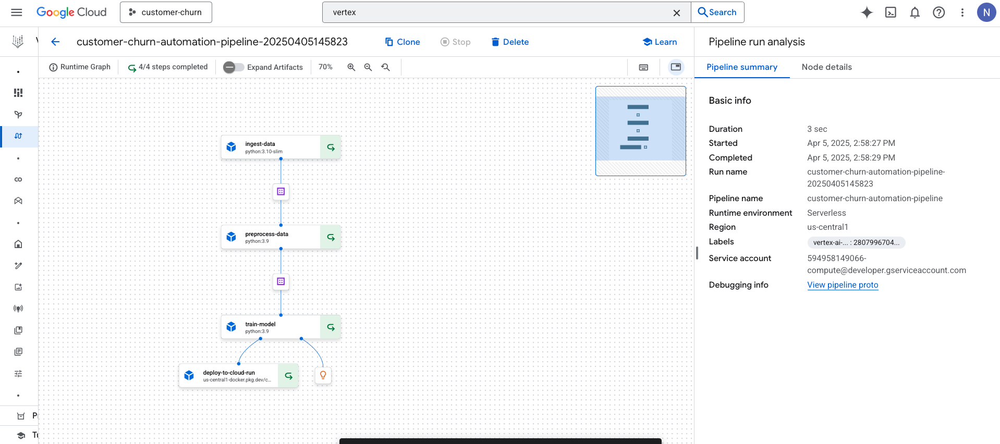

# Customer Churn ML Pipeline 🚀

An end‑to‑end machine learning pipeline in Python for predicting customer churn, covering data processing, model training, evaluation, and deployment-ready components.

## 🔧 Pipeline Architecture

---

## Table of Contents

1. [Overview](#overview)  
2. [Features](#features)

---

## Overview

This project delivers a reusable pipeline for:
- Ingesting and cleaning tabular customer data,
- Feature engineering and preprocessing (handling missing values, encoding, scaling),
- Training machine learning models (e.g., Logistic Regression, Random Forest, XGBoost),
- Saving the best model and generating inference-ready artifacts.

Ideal for businesses aiming to proactively address customer churn through data-driven strategies.

---

## Features

- **Modular pipeline**: Easily plug in new data sources or replace components.
- **Scalable preprocessing**: Handles categorical, numeric, and missing-value cleaning.
- **Model persistence**: Exported via `joblib`.
- **Configuration-driven**: All paths and parameters defined in a single `.yaml` or `.json`.
- **Deployment-ready**: Deploys to VertexAI endpoint.